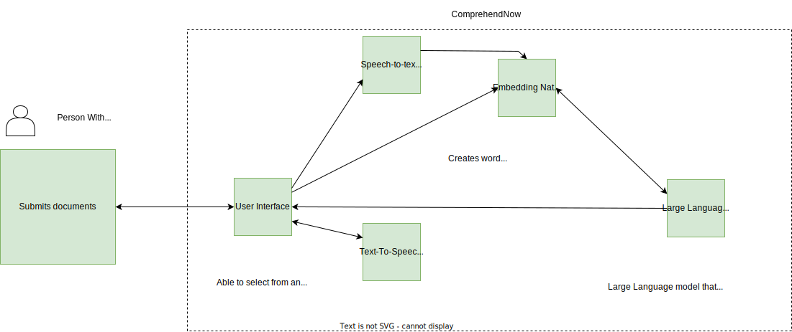

# Use Case Story Title

<!--- Template Instructions  
  Update the Story Title and remove the warning below.
--->

 Before submitting your project repo, modify template as desired and remove all inline  Template Instructions. 

<!--- Template Instructions  
  Organize TOC to meet needs or project
--->
#### Table of Contents
- [Use Case Story Title](#use-case-story-title) 
      - [Table of Contents](#table-of-contents)
  - [Acknowledgements](#acknowledgements)
  - [Business Challenge](#business-challenge)
    - [Concept](#concept)
    - [Approach](#approach)
  - [Vernacular](#vernacular)
  - [Assumptions](#assumptions)
  - [Persona](#persona)
  - [Story](#story)
  - [Demo Workflow](#demo-workflow)
    - [Step 1](#step-1)
    - [Step 2](#step-2)

 
## Acknowledgements

<!--- Template Instructions   
  List any acknowledgements pertaining to the concepts and resources used in this use case story.
--->

1. This scenario leverages a fictitious company called, _Acme Enterprise_. The  Acme Enterprise logo is borrowed from [Katie Wickens](https://steins_kake.artstation.com/projects/ebqgb), a graphics designer.
 
## Business Challenge
<!--- Template Instructions   
  Briefly describe the business challenge addressed by this use case story. Design Thinking exercises aid in the development of a clear problem statement. 
--->
 
### Concept
<!--- Template Instructions   
  Briefly describe how this use case applies Atomic Accessibility Design to the business challenge. Leverage Design Thinking exercises to aid in this endeavor. 
--->
 
### Approach
<!--- Template Instructions   
  Describe the end to end interactions of the stakeholders that are pertinent to this use case story. Leverage Design Thinking exercises to aid in this endeavor. 
--->

 
## Vernacular
<!--- Template Instructions   
  List and describe any terms that will be used in the story and referenced in diagrams. The current list provides a sample starter list. Leverage Design Thinking exercises to aid in the identification of use case archetypes. 
--->

## Assumptions
<!--- Template Instructions   
  List any assumptions to be considered in this use case story.  Leverage Design Thinking exercises to aid in this endeavor. 
--->
 
1. *it's assumed that people with disabilities who want to understand a document have access to it in a digital format*

2. *It's assumed that people with disabilities who use the solution have some level of familiarity with digital technology and are able to use a web or messaging application to upload documents*
 
## Persona
<!--- Template Instructions   
  Using the sample persona images in the /images/persona folder, describe the roles of the entities involved in this use case story. The current list provides a sample starter list. 
--->
 
| Actor                                                                    | Role                                   | Goals                                                                                             | Details |
|--------------------------------------------------------------------------|----------------------------------------|---------------------------------------------------------------------------------------------------| --- |
|    Axa                   | Insurance Company                      | Help users with disabilities understand their policies.                                           |  |  
|  Laura                 | Customer Service Representative at Axa | Ensure customers get all the help they need                                                       |  |
|  Mark                  | Person with Disability                 | Has difficulty understanding complex language and would like a solution that helps him understand |  |
|  ComprehendNow | Web and Mobile messaging app           | Breakdown complex language in documents so that it's easily understandable.                       | |
 
## Story
<!--- Template Instructions   
  Using the sample persona images in the /images/persona folder, describe the steps that are involved in the interactive use case story. The story below is offered as an exemplar.
--->

 Axa has rolled out new and exciting covers on their insurance policies, they sent out the details of the new covers in a .pdf format to their customers. 

 Mark received the notification from his insurance company AXA informing him that new covers have been added to his policy. He is excited to know more about the new covers, but he is also concerned that he might not be able to understand the information properly due to his cognitive disability.

  Mark decides to contact the insurance company and request for the new policy documents to be explained to him in a simple and clear manner. The customer service representative,   Laura understands   Mark's needs and sends him the link to   ComprehendNow so that he can find what he needs in the policy document in simplified language and with clear explanations of the new covers.

  Mark is relieved to find that he can easily understand the information and can access it at any time he wants, even from his favorite messaging app. He is also pleased that he can easily ask questions on the policy document if he has any questions or needs clarification.
 
## Demo Web App Workflow
<!--- Template Instructions   
  Using the sample persona images in the /images/persona folder, describe the steps of the use case story as they relate to one or more UML Sequence Diagrams.  
--->
 
### Step 1

 Mark opens ComprehendNow.
 

 
### Step 2

 Mark chooses the language that he wants to interact in and an accessibility profile(Generated with  Atomic Accessibility Design Tool from Discover  Mark opens ComprehendNow.) that fits his needs.
 

### Step 3

 Mark uploads the document from his insurance company.
 

### Step 4

 Mark's document is analyzed and explained to him in simplied language.
 

### Step 5

 Mark asks questions on the areas that he would like more information on and he is answered.
 

## Demo Messaging App Workflow
<!--- Template Instructions   
  Using the sample persona images in the /images/persona folder, describe the steps of the use case story as they relate to one or more UML Sequence Diagrams.  
--->
 
### Step 1

 Mark opens his favorite messaging app Telegram and starts a chat with the ComprehendNow Telegram bot.
 

 
### Step 2

 Mark replies in the language that he wants to interact in.
 

### Step 3

 Mark uploads the document from his insurance company.
 

### Step 4

 Mark's document is analyzed and explained to him in simplied language.
 

### Step 5

 Mark asks questions on the areas that he would like more information on and he is answered.
 
