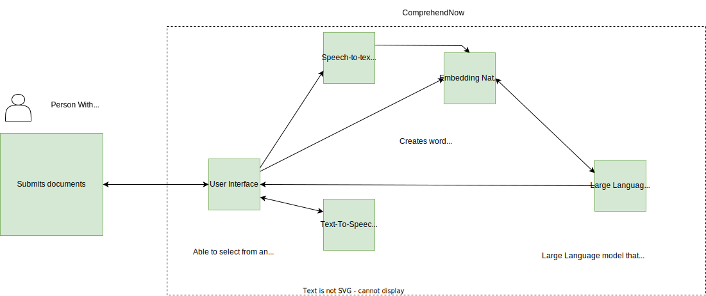
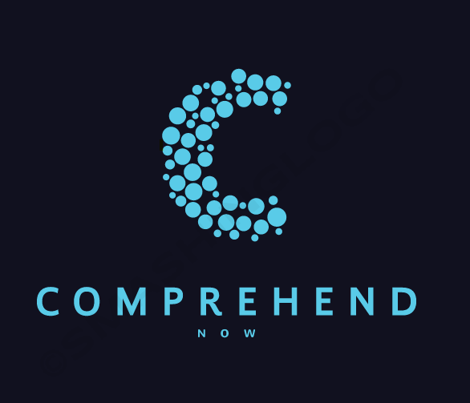
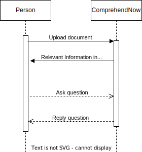

# Improving Accessibility of Insurance Policy Documents for People with Disabilities

#### Table of Contents
- [Improving Accessibility of Insurance Policy Documents for People with Disabilities](#use-case-story-title) 
      - [Table of Contents](#table-of-contents)
  - [Business Challenge](#business-challenge)
    - [Concept](#concept)
    - [Approach](#approach)
  - [Assumptions](#assumptions)
  - [Persona](#persona)
  - [Story](#story)
  - [Demo Web App Workflow](#demo-web-app-workflow)
  - [Demo Messaging App Workflow](#demo-messaging-app-workflow)
  - [Sequence Diagram](#sequence-diagram)

 
## Business Challenge
How might we design a solution that presents information from complex documents in a simplified, easy-to-understand format?
 
### Concept
A Natural Language Processing chatbot that allows users to submit complex documents, receive a short summary of the document, and ask questions.
 
### Approach

## Assumptions
 
1. *it's assumed that people with disabilities who want to understand a document have access to it in a digital format*

2. *It's assumed that people with disabilities who use the solution have some level of familiarity with digital technology and are able to use a web or messaging application to upload documents*
 
## Persona

| Actor                                                               | Role                                   | Goals                                                                                             | Details |
|---------------------------------------------------------------------|----------------------------------------|---------------------------------------------------------------------------------------------------| --- |
|    Axa              | Insurance Company                      | Help users with disabilities understand their policies.                                           |  |  
|  Laura            | Customer Service Representative at Axa | Ensure customers get all the help they need                                                       |  |
|  Mark                  | Person with Disability                 | Has difficulty understanding complex language and would like a solution that helps him understand |  |
|  ComprehendNow | Web and Mobile messaging app           | Breakdown complex language in documents so that it's easily understandable.                       | |
 
## Story

 Axa has rolled out new and exciting covers on their insurance policies, they sent out the details of the new covers in a .pdf format to their customers. 

 Mark received the notification from his insurance company AXA informing him that new covers have been added to his policy. He is excited to know more about the new covers, but he is also concerned that he might not be able to understand the information properly due to his cognitive disability.

  Mark decides to contact the insurance company and request for the new policy documents to be explained to him in a simple and clear manner. The customer service representative,   Laura understands   Mark's needs and sends him the link to   ComprehendNow so that he can find what he needs in the policy document in simplified language and with clear explanations of the new covers.

  Mark is relieved to find that he can easily understand the information and can access it at any time he wants, even from his favorite messaging app. He is also pleased that he can easily ask questions on the policy document if he has any questions or needs clarification.
 
## Demo Web App Workflow
 
### Step 1

 Mark opens ComprehendNow web app.
 
### Step 2

 Mark chooses the language that he wants to interact in and an accessibility profile(Generated with  Atomic Accessibility Design Tool from Discover  Mark opens ComprehendNow.) that fits his needs.

### Step 3

 Mark uploads the document from his insurance company.

### Step 4

 Mark's document is analyzed and explained to him in simplied language.

### Step 5

 Mark asks questions on the areas that he would like more information on and he is answered.

## Demo Messaging App Workflow
 
### Step 1

 Mark opens his favorite messaging app Telegram and starts a chat with the ComprehendNow Telegram bot.
 
### Step 2

 Mark replies in the language that he wants to interact in.

### Step 3

 Mark uploads the document from his insurance company.

### Step 4

 Mark's document is analyzed and explained to him in simplied language.

### Step 5

 Mark asks questions on the areas that he would like more information on and he is answered.

## Sequence Diagram
 
